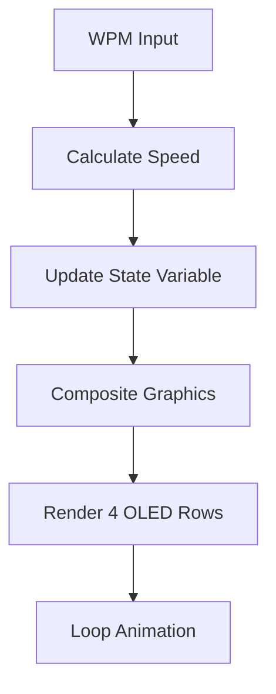

# AGENTS.md

## Purpose

Guide for AI agents modifying the `antoine` userspace. This userspace implements a complex multi-layer Miryoku layout with custom OLED animations and cross-platform support.

## Architecture

### File Structure
```
users/antoine/
├── antoine.c  # Main implementation
├── antoine.h  # Layer definitions and enums
├── config.h                         # Build configuration
├── rules.mk                         # Build rules
└── features/                        # Custom features module
    ├── caps_word.c                   # Caps word implementation
    └── caps_word.h                   # Caps word header
```

### Core Components

#### Layers (13 total)
```c
enum layers { 
    COLEMAK, QWERTY, GAMING_QWERTY, GAMING_COLEMAK, 
    BUTTON, MEDIA, NAV, MOUSE, FUN_G, NUM_G, SYM_G, FUN, NUM, SYM 
};
```

#### Key Defines
- `U_NP` (KC_NO): Key not present
- `U_NA` (KC_NO): Present but unavailable
- `U_NU` (KC_NO): Available but unused

#### Clipboard Variants
Conditional compilation for different OS:
- `MIRYOKU_CLIPBOARD_FUN` (default)
- `MIRYOKU_CLIPBOARD_WIN`
- `MIRYOKU_CLIPBOARD_MAC`

## Modification Rules

### Layer Modifications
1. Preserve `LAYOUT_antoine()` macro calls in all layers
2. Maintain thumb cluster functionality (6 keys per hand)
3. Keep home row mod-tap structure (LGUI_T/LCTL_T/LSFT_T/LALT_T)
4. Gaming layers must keep modifiers on bottom row

### Key Function Limits
Maximum 4-5 functions per key:
- Base keycode
- Layer-tap (LT)
- Mod-tap (MT variants)
- One-shot (OSM)
- Combo trigger

### OLED Animation System
- **Function**: `render_space()` in `.c` file
- **State Variable**: `unsigned int state` for animation frame tracking
- **WPM Response**: Animation speed proportional to `get_current_wpm()`
- **Graphics**: 4-row custom bitmaps (space_row_1/2/3/4, ship_row_1/2/3/4)
- **Masking**: Dynamic compositing using mask_row_1/2/3/4



### Custom Tap Timing
```c
uint16_t get_tapping_term(uint16_t keycode, keyrecord_t *record) {
    switch (keycode) {
        case LGUI_T(KC_A):
        case LGUI_T(KC_O):
            return 300;  // GUI-mod keys
        case LT(FUN, KC_ESC):
            return 150;  // FUN layer access
        default:
            return TAPPING_TERM;
    }
}
```

## Critical Constraints

### Do Not Break
1. **Cross-platform clipboard support** - All three variants must compile
2. **Caps word integration** - `process_caps_word()` call in `process_record_user()`
3. **OLED animation** - Preserve WPM-responsive behavior
4. **Home row mods** - Keep ergonomic Miryoku structure
5. **Gaming layer optimization** - Maintain bottom-row modifier placement

### Must Preserve
- `#include "antoine.h"` in keyboard keymaps
- Caps word feature integration: `features/caps_word.c` and `.h`
- OLED enable conditionals and animation functions
- Custom tapping term implementation
- Layer enum order and definitions

## Adding Keyboard Support

1. Create keymap directory with `keymap.c`:
```c
#include QMK_KEYBOARD_H
#include "antoine.h"

const uint16_t PROGMEM keymaps[][MATRIX_ROWS][MATRIX_COLS] = {
    // Copy layers from antoine.c
    // Adjust layout macro call as needed
};
```

2. Add keyboard-specific `config.h` and `rules.mk`
3. Ensure OLED support for animations
4. Test all 13 layers thoroughly

## Testing Requirements

### Required Tests
- All 13 layer functions
- Caps word activation (double-shift)
- OLED animation on both halves
- All clipboard variants (WIN/MAC/FUN)
- Custom tap timing
- Gaming layer modifier placement
- Cross-compilation with all build flags

### Build Validation
```bash
qmk compile -kb [keyboard] -km antoine -e MIRYOKU_CLIPBOARD=WIN
qmk compile -kb [keyboard] -km antoine -e MIRYOKU_CLIPBOARD=MAC
qmk compile -kb [keyboard] -km antoine -e MIRYOKU_ALPHAS=COLEMAK
```

## Common Tasks

### Adding New Layer
1. Add to layer enum in `.h`
2. Implement in `.c` using `LAYOUT_antoine()`
3. Add layer switch key to existing layers
4. Test key functionality

### Modifying OLED Animation
- Edit bitmap data arrays (space_row_*, ship_row_*, mask_row_*)
- Adjust `render_space()` compositing logic
- Preserve WPM-responsive state variable update
- Test animation smoothness

### Customizing Tap Timing
- Add new cases to `get_tapping_term()`
- Use appropriate timing values (150-300ms typical)
- Consider key position and function